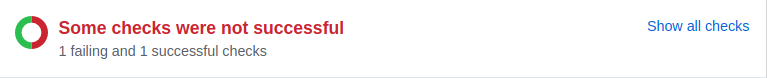

# EggTimer

EggTimer is a bot that automatically merges GitHub pull requests when
they are ready. EggTimer is a node.js script and a GitHub webhook.

Upon startup and when the configured GitHub repository changes, the bot
finds pull requests that are ready for merging and, one by one, triggers
CI tests and eventually merges successfully tested PRs. Eligible pull
requests are merged in FIFO (i.e., ascending PR number) order. Pull
request eligibility and merging steps are detailed further below.


## Terminology

* _Merging_: Merging a pull request involves many steps, including
  automated CI tests, PR labeling, and the target branch update. Do not
  confuse this general/imprecise term with the atomic action of merging
  one git branch into another.

* _Core developer_: From the bot point of view, a core developer is a
  GitHub user with write access to the configured repository (`config::repo`).


## Which pull requests are eligible for merging?

A pull request is ready for merging if all of the following conditions
are satisfied:

* The PR is open.
* The PR has GitHub `mergeable` status. In this case, GitHub displays
  "This branch has no conflicts with the base branch" message next
  to a green check mark.
* All the _required_ checks have succeeded on the (possibly stale)
  PR branch:
   * If _all_ checks have succeeded, GitHub says "All checks have passed"
     next to a green check mark:
  
   * If an _optional_ check has failed, but all _required_ ones have passed,
  GitHub will show "Some checks were not successful" message:
  
* The PR is approved for merging (see below for voting rules).
* The PR has a valid PR title and PR description (see below about
  writing PR descriptions).
* The PR does not have an `S-merged` label.

Satisfying the above conditions results in an attempt to merge the pull
request (in FIFO order), but PR merging may still fail.


## Pull request merging algorithm

Each open pull request is processed according to the following
algorithm:

1. Create a new commit ("staging commit") as a copy of the PR [merge commit](https://developer.github.com/v3/pulls/#get-a-single-pull-request),
   with the following attributes:
   * parent revision as the PR base branch HEAD revision
   * commit message as the PR title (with appended PR number) and the
     PR description
2. Reset the staging (a.k.a. "auto") branch to the PR staging commit.
3. Mark the staging commit with a tag ("merge tag"). The tag holds
   the being-in-merge PR number, which is used by the bot in next steps.
4. Test the staging branch. That is, wait for GitHub to report CI test
   results for the staging branch.
5. Reset the PR target branch (usually "master") to the now-tested
   staging commit on the staging branch.
6. Mark the PR as merged, close the PR and remove its tag.

If a bot is killed while executing the above algorithm, it will
resume executing from the step it was interrupted at.

While the bot is merging a pull request, it does not touch other PRs. If
the bot receives a GitHub event while merging a pull request, then the
bot re-examines all PRs _after_ it is done merging the current PR. This
approach simplifies repository state (multiple PRs in various
intermediate merging steps would easily confuse humans and may overwhelm
CI) while still allowing the lowest-numbered PR to be merged first
(among the then-ready PRs).


## Error handling

A bot that cannot parse its configuration quits.

When encountering PR-unrelated problems (e.g., network I/O timeouts or
internal GitHub server errors), the bot sleeps for 10 minutes
(hard-coded) and then effectively restarts. Only the already parsed
configuration is preserved across such restarts.

If a PR processing step fails for PR-specific reasons (e.g., a CI test
failure), then the bot moves on to the next pull request, marking the
failed PR if/as needed (see below for PR labels).


## Pull request labels

The bot uses the following GitHub labels to mark the current pull
request state:

* S-merging: The PR is being processed by the bot. The bot eventually
  replaces this label with one of the other labels below.
* S-staging-checks-failed: Essentially duplicates GitHub "red x" mark for
  the staging branch commit. The bot removes this label when it notices
  that the failed checks are no longer fresh/applicable.
* S-merge-ready: Duplicates GitHub "green check" mark for the staging
  branch commit. The bot removes this label before it updates the PR
  target branch. Applied only if `config::skip_merge` option is on
  (see below).
* S-merge-failed: Unrecoverable failure other than the staging branch
  test failure (the latter is marked with `S-staging-checks-failed`). The
  bot ignores this PR until the PR branch or its target branch change.
  When the bot notices that change, it removes this label.
* S-merged: The PR was successfully merged (and probably closed). The
  bot will not attempt to merge this PR again even if it is reopened.
  The bot never removes this label.
* S-invalid-message: The PR title and(or) message is invalid (see
  below about writing PR descriptions).

Note that all labels, except `S-merged` are ignored by the bot itself.

TODO: Rename all the remaining labels to form a cohesive set, probably
with a dedicated prefix like "M-".

## Writing PR descriptions

The PR description and title must conform to a common 72 characters/line
rule. Bot ignores PRs with long descriptions, marking it with
`S-invalid-message` label.


## Voting and PR approvals

A single negative vote by a core developer disqualifies the pull request
from automatic merging. Also a pull request is postponed from the merging
until there is a requested pull request review from a core develper.
If there are no such votes and requested reviews, a PR is considered
approved for merging if either of the following two conditions is met:

* Fast track: A PR has at least two approvals
  (`config::sufficient_approvals`) from core developers and has been
  open for at least 48 hours (`config::voting_delay_min`). The delay
  gives all core developers a better chance to review the pull request
  before it gets merged while still supporting a decent development
  pace.

* Slow burner: A PR has at least one approval
  (`config::necessary_approvals`) from a core developer and has been
  open for at least 10 calendar days (`config::voting_delay_max`). The
  wait limit allows for eventual automated merging of pull requests that
  failed to attract a lot of attention while still properly vetting the
  changes.

The bot uses two sources of information when counting votes:

1. GitHub review votes.

2. PR authorship: The PR author is assumed to approve PR code. The bot
   uses this assumption because GitHub does not allow PR authors to
   vote, needlessly slowing down PR acceptance.

Allowing a developer to submit a PR without implicitly approving it is a
missing feature. This feature is especially useful when a core developer
submits 3rd-party code that they did not have a chance to properly
review.

Votes by users other than core developers are currently _not_ counted.
Properly counting such votes is a missing feature.


## Bot lifecycle

The bot may be started like any node.js script. For example:

```
node eggtimer.js
```

The bot can be safely killed and started at any time because it uses the
public/remote GitHub repository to store PR processing state. The bot
does not clone the repository.


## Configuration

The bot is a GitHub [webhook](https://developer.github.com/webhooks/)
(i.e., an HTTP server expecting requests from GitHub). To configure your
GitHub repository to notify the bot, go to Settings-&gt;Webhooks and
click the "Add webhook" button.

### GitHub configuration

* The "payload URL" is comprised of the "http" scheme, the
  host name or IP address of the server hosting the bot, bot port (`config::port`), and bot URL path (`config::github_webhook_path`) values.
* The "Content type" field should be `application/json`.
* The "secret" field should match bot `config::github_webhook_secret`.
* The bot needs to receive `Pull request`, `Pull request review`, and `Status` events.


### Bot configuration

The bot loads its configuration from `./config.json`. You may use
`config-example.json` to bootstrap your configuration.

All configuration fields are required.

*Field* | *Description* | *example*
--- | --- | ---
*github_username* | The bot uses this GitHub user account for all GitHub communications, including target branch updates. This user needs to have write access to the repository.| "github_bot_username"
*github_token* | An authentication token generated for the associated `config::github_bot_username`. | "quai5lieviegoh7na7eej3wuu5quahju8jah1di0"
*github_webhook_path* | GitHub webhook URL path. | "/egg-timer"
*github_webhook_secret* | A random secret string to be used here and in the GitHub webhook configuration. | "maupoos1lirae9pein0chi3ohzikoideing4eesh"
*host* | The bot listens for GitHub requests on this IP address. If empty string, the bot will listen on all available IP interfaces. | ""
*port* | The bot listens for GitHub requests on this TCP port. | 7777
*repo* | The name of the GitHub repository that the bot should serve. | "squid"
*owner* | The owner (a person or organization) of the GitHub repository. | "squid-cache"
*dry_run*| A boolean option to enable read-only, no-modifications mode where the bot logs pull requests selected for merging but skips further merging steps.| false
*skip_merge*| A boolean option to enable no-final-modifications mode where the bot performs all the merging steps up to (and not including) the target branch update. Eligible PRs are merged into and tested on the staging branch but are never merged into their target branches. | false
*staging_branch* | The name of the staging branch. | auto
*necessary_approvals* | The minimal number of "core" developers required for a PR to become eligible for merging. PRs with fewer votes are not merged, regardless of their age. | 1
*voting_delay_min*| The minimum merging age of a PR. Younger PRs are not merged, regardless of the number of votes. PR age is measured in hours from the PR creation time. | 48
*sufficient_approvals* | The minimal number of core developers required for a PR to be merged fast (i.e., without waiting for `config::voting_delay_max`) | 2
*voting_delay_max* | The maximum merging age of a PR that has fewer than `config::sufficient_approvals` votes. PR age is measured in hours from the PR creation time. | 240


## Caveats

### Merging eligibility may change while merging

The bot checks merge eligibility conditions when starting to process a
given pull request. It is possible that a checked condition changes
during or after that initial check. There is no guarantee that the bot
will notice such "late" changes. Similar race conditions exist for
manual PR merging, of course.


### GitHub does not know that a PR was merged

GitHub does not recognize auto-merged PRs as merged -- it shows the
following message instead of the purple "Merged" icon:


Even with a single-commit PR, the merged commit has a different commit
message (and often different code!) than the PR branch commit. When
squash-merge or rebase-merge commits are used, the differences between
the merged commit SHA and the PR branch SHA prevent GitHub from
recognizing that the PR was effectively merged. GitHub itself provides
Squash Merge and Rebase Merge buttons that do not lose merge
information, but GitHub probably uses some GitHub-specific information
to track such merged PRs. We failed to find an API to tell GitHub that a
PR is effectively merged.

TODO: Ask GitHub support for help or request an API enhancement.
